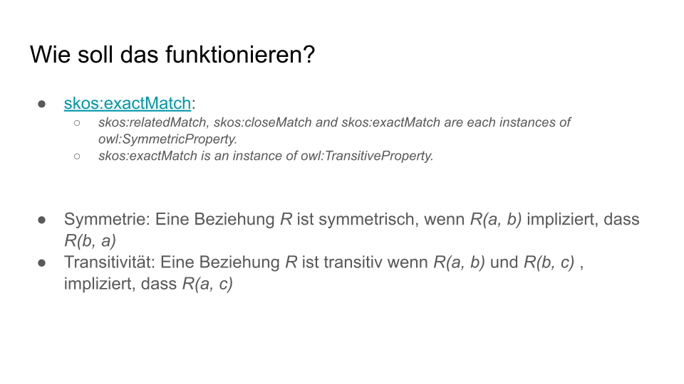
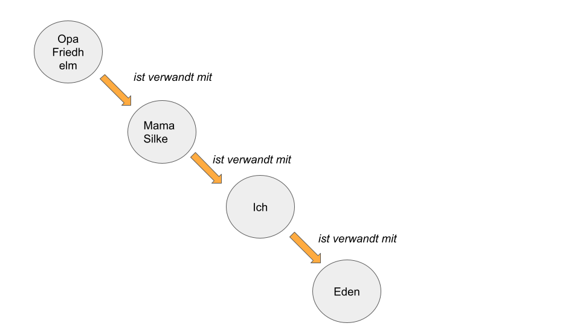
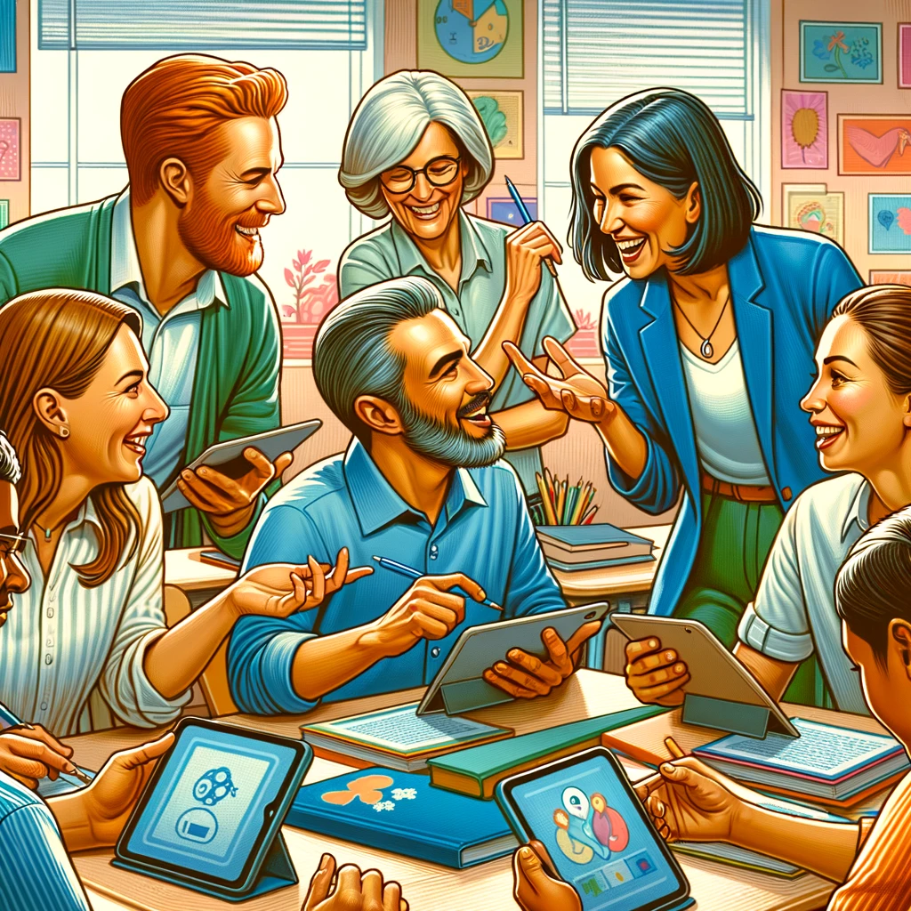

## (Un)soziale Bildungsinfrastrukturen 

Haben wir da nicht was vergessen?

<!-- Ein Vorschlag zur Nutzung dezentraler Social Media Protokolle in Bildungsinfrastrukturen -->

---

Steffen Rörtgen

Softwareentwickler und Berater für IT im Bildungsbereich

#OER #LinkedData #DecentralizedTechnologies

---

M.Ed. Latein und Philosophie

🧑‍🏫

- Jointly
- WirLernenOnline
- Nationale Bildungsplattform
- metadaten.nrw
- Ab August: MEM-Projekt der FWU

- ansonsten: OER-Metadatengruppe, Curricula-Gruppe, OER-Beirat

---

## Rolle in STIL

Vernetzte IT-Bildungsinfrastruktur als Beitrag zur Stärkung (kooperativer) Hochschullehre

#Interoperabilität #Schnittstellen #Metadaten

Handreichung, Workshops, Koordination von Arbeitsgruppen, Prototypen

---

## Metadaten

---

{width=50%}

---

Metadaten können standardkonform in Ressourcen eingebettet werden

➡️ am gleichen Ort: URL (Uniform Resource Locator), keine gesonderte Schnittstelle

➡️ erleichtert die Nachnutzung 👩‍🔬 👩‍💻

---

### OER Metadatengruppe

- Entwicklung von Metadatenprofilen für Bildungsressourcen (Beispiel: [AMB](https://dini-ag-kim.github.io/amb/latest/))
- Austausch rund um die Themen Metadaten im Bildungsbereich
- unabhängige Dachorganisation: DINI e.V. (Deutsche Initiative für Netzwerkinformation e.V.), KIM (Kompetenzzentrum interoperable Metadaten)
- Bildungsbereichsübergreifend (Schule, Hochschule, Erwachsenenbildung,..)

- [One Pager OER-Metadatengruppe](https://docs.google.com/document/d/1C1_SAaRfS7Lp75GyRg2wVeKVKqQHI51hr_C2bj6880U/edit)

---

### AG Didaktische Metadaten Hochschule

- initiiert durch STIL-Kooperation
- \> 25 Teilnehmer:innen verschiedener Hochschulportale
- monatliche Treffen
- Arbeit an konkreten Anwendungsfällen: *Wie kann ich eine problemorientierte Suche ermöglichen? Welche Klassifikation kann ich zur Auszeichnung meiner Ressourcen nutzen?*

---

### Curricula Gruppe

Lehrpläne sind Arbeitsgrundlage von Lehrenden
...liegen aber nicht in maschinenlesbarer Form vor

➡️ Lehrende (und auch Lernende) würden jedoch massiv davon profitieren, wenn Bildungsressourcen direkt mit Einträgen in einem Lehrplan verknüpft würden

---

---

---

---

---

---

---

---

## Herausforderungen Curricula

- Daten aus den Bundesländern werden benötigt
- Wie viele Beziehungen sind tatsächlich "exact Matches" ?
- *Wer* definiert die Beziehungen?

- MEM-Projekt der FWU ist mit Digitalisierung der Lehrpläne im Schulbereich beauftragt worden
- ➡️ in der Curricula-Gruppe 🙌

---

...aber selbst wenn wir das alles haben, stehen wir vor der nächsten Herausforderung...

*Zentralität und Unbeständigkeit von (öffentlich finanzierten) Bildungsplattformen*

---

## Soziale Infrastrukturen

Warum gibt es nur ein Instagram?

Ein Facebook?

Ein Twitter / X?

Ein Reddit?

---

Netzwerk-Effekt

{width=50%}

<!-- https://pixabay.com/de/photos/spielsteine-netzwerk-vernetzt-1237457/ -->

---

{width=50%}

---

## Öffentliche Bildungsinfrastrukturen

Welche sozialen Komponenten nutzen WLO, ZOERR, Mundo und NBP?  

- <https://www.zoerr.de/>
- <https://wirlernenonline.de/>
- <https://oersi.org/resources/>
- <https://www.meinbildungsraum.de/>
- <https://mundo.schule/>

---

{width=50%}

---

✅ Engagement in offenen Gruppen

✅ Interoperable Metadaten für Bildungsressourcen

❌ Interoperable Nutzerinteraktionen

---

➡️ Bildungsplattforminitiativen fördern den Bau neuer Datensilos:

Silos der Nutzerinteraktionen

Liken, Kommentieren, Zusammenstellen zu Listen

---

## Warum ist das problematisch?

---

Budgets:

- WirLernenOnline: 2,9M Euro (bis 2021) [^1]
- Sodix / Mundo: 4,2M Euro [^2]
- NBP / Bildungsraum: 630M Euro [^3] (Summe ist mittlerweile aber reduziert worden)

[^1]: https://www.bundesrechnungshof.de/SharedDocs/Downloads/DE/Berichte/2022/massnahmen-digitalpakt-schule-volltext.pdf?__blob=publicationFile&v=1
[^2]: https://www.bmbf.de/SharedDocs/Publikationen/de/bmbf/3/31715_Fortschrittsbericht_DigitalPakt_Schule_2019_bis_2022.pdf?__blob=publicationFile&amp%3Bv=6
[^3]: https://www.fdpbt.de/anfrage/kleine-anfrage-nationale-bildungsplattform-einem-digitalen-bildungsraum

---

Forschung

⚡

Betrieb von Plattformen

⚡

Entwicklung von Geschäftsmodellen

👩‍🔬 ❌  🤑

---

Die Plattformen haben User, die auf ihnen arbeiten sollen...

> [...] Alle zu erarbeitenden Ergebnisse beziehungsweise Artefakte sind als OER nachhaltig nutzbar über [...]OER-Referatorien (z. B. wirlernenonline.de) [...] zu veröffentlichen [...] [^bmbfwlo]

...aber kein Geschäftsmodell, so einen Service dauerhaft zu betreiben.

[^bmbfwlo]: https://www.bmbf.de/bmbf/shareddocs/bekanntmachungen/de/2023/05/2023-05-08-Bekanntmachung-OER.html

---

Was passiert, wenn Plattform XY offline geht?

  
   

Alle Interaktionen ➡️ 🗑️

---

...weil wir schöne Walled Gardens bauen, kann auch niemand einen besseren Service entwickeln...

---

Edu Tech Start Ups in Deutschland?

<iframe src="https://giphy.com/embed/5x89XRx3sBZFC" width="480" height="221" frameBorder="0" class="giphy-embed" allowFullScreen></iframe>

---

- Warum keine Interoperabilität?
- Öffentliche Bildungsplattformen sammeln massenhaft gleiche Materialien ein  
- Warum ist das Material, das ich bei A like, nicht auch bei B geliked?  
- Warum sind Kollektionen, die ich in einem Tool erstelle, nicht auch im anderen sichtbar?

---

❓ Warum ist keine plattformübergreifende Kollaboration möglich?

❓ Geht es anders?

---

Learning Record Store? Wallet? Irgendwas mit KI, *insert_buzzword_here*

---

<!-- keine Kontrolle über die eigene Identität -->

<!-- ...und die kann sich schnell wechseln, besonders im wissenschaftlichen Umfeld -->

<!-- --- -->

Was ist Lernen? ➡️ Soziale Interaktion 🫂

Wo findet Lernen statt? ➡️ Überall 🌎 

 

---

Vorschlag: Nutzung dezentraler Social Media Protokolle ➡️  Nostr

**Notes And Other Stuff Transmitted By Relays**  

---

**Achtung: Potentieller Technology Push**

---

- keine zentralen Komponenten
- Kontrolle über die eigene Identität 
- portabler sozialer Graph

---

<!--  -->

---

- 🫂 Soziale Interkationen (kryptografisch signiert)
- 💌 Verschlüsselte Nachrichten
- 👨🏾‍🤝‍👨🏼👨🏾‍🤝‍👨🏼👨🏾‍🤝‍👨🏼 Gruppen (+ Moderation)
- 📜 Long-Form Posts (Markdown)
- 🖋️ Kollaborative Annotationen
- 📺 Live Activites (e.g. Streaming)
- 🌎 Geodaten
- 🥇 Badges
- 📁 Dateimetadaten
- 💸 Payments
- 🛒 Marketplaces
   
---

Lasst uns Plattformen ohne Datensilos bauen

Lasst uns Wettbewerb ermöglichen  
   
**"Developers, tear down this wall" - PabloF7z, 08.08.2023**  

---
